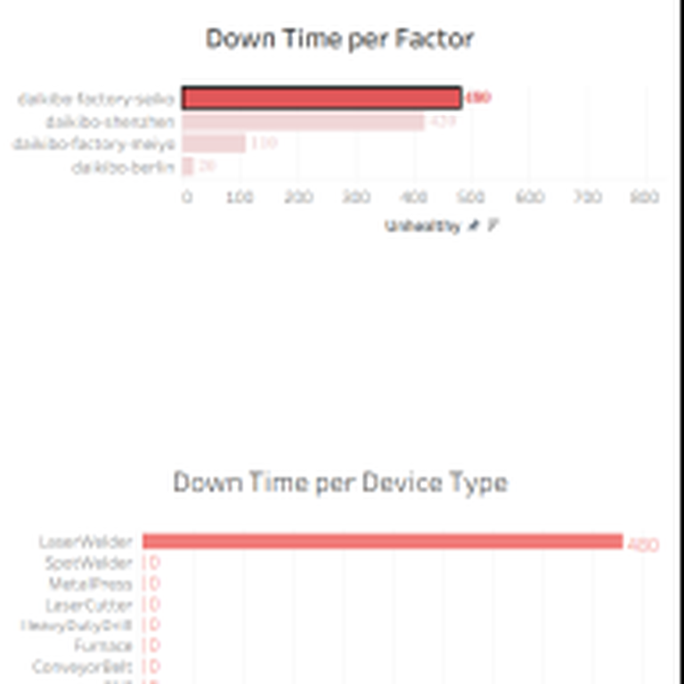
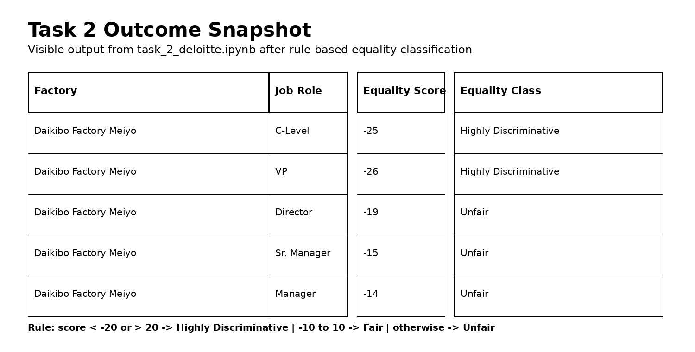

# Deloitte Data Analytics Job Simulation


## Overview

This repository documents the work completed during the **Deloitte Data Analytics Job Simulation**, completed in **September 2026**. The certificate records practical work in **data analysis** and **forensic technology** and was issued through **Forage**.

The repository contains two project artifacts that demonstrate different parts of the simulation:

- **Task 1 - Tableau telemetry analysis:** an interactive dashboard built from Daikibo factory telemetry data to investigate unhealthy-device signals across factories and device types.
- **Task 2 - Python equality classification:** a pandas-based data transformation workflow that classifies equality scores into business-defined categories and exports the processed table to Excel.

Together, the projects demonstrate practical skills in **data cleaning, exploratory analysis, business-rule implementation, data visualization, calculated fields, filtering, and analytical reporting**.

---

## Certificate

The certificate confirms completion of the **Deloitte Data Analytics Job Simulation** on **September 19, 2026**, with practical tasks covering **data analysis** and **forensic technology**.


---

# Project 1 - Daikibo Factory Telemetry Analysis

### Objective

Analyze telemetry data from Daikibo manufacturing facilities and build a Tableau view that helps identify where unhealthy device activity is concentrated.

### Data Source

The Tableau workbook is configured to use:

`daikibo-telemetry-data.json`

The workbook maps fields including:

- `factory`
- `city`
- `country`
- `area`
- `section`
- `deviceID`
- `deviceType`
- `status`
- `temperature`
- `timestamp`

### Analytical Approach

A Tableau calculated field named **Unhealthy** converts device status into a simple analytical measure:

```text
IF [status] = "unhealthy" THEN 10
ELSE 0
END
```

This produces a **10-point contribution for each unhealthy record**, allowing unhealthy activity to be aggregated and compared visually.

Two main analytical views were created:

1. **Down Time per Factor**
   - Aggregates the unhealthy measure by factory.
   - Sorts factories by the calculated unhealthy measure.
   - Uses a factory filter/action so the dashboard can be explored interactively.

2. **Down Time per Device Type**
   - Breaks unhealthy activity down by device type.
   - Uses the selected factory context to support drill-down analysis.

### Tableau Outcome

The saved `.twb` workbook contains a dashboard named **Task 1** with the two views above and an interactive factory selection/filter action.



### Key Insight

The dashboard structure makes it possible to move from a **facility-level question** ("Which factory has the strongest unhealthy signal?") to a **device-level question** ("Which device types contribute most within that context?").

> **Important interpretation note:** the workbook's `Unhealthy` calculation assigns 10 to an unhealthy record. Therefore, the displayed measure should be treated as an **unhealthy-activity proxy**, not literal minutes of machine downtime.

---

# Project 2 - Equality Score Classification with Python

### Objective

Transform an equality-score dataset into a consistent classification that can be used to flag potentially discriminatory or unfair results.

### Input Data

The notebook reads an Excel file:

```text
Task 5 Equality Table.xlsx
```

The source contains these columns:

```text
Factory
Job Role
Equality Score
Equality class
```

### Tools & Libraries

The implementation uses:

- **Python**
- **pandas**
- **Excel I/O via `pandas.read_excel()` and `DataFrame.to_excel()`**

### Classification Algorithm

A custom Python function applies the business rules:

```python
def equality_score(score):
    if score < -20 or score > 20:
        return "Highly Discriminative"
    elif -10 <= score <= 10:
        return "Fair"
    else:
        return "Unfair"
```

The classification is then applied to the complete score column:

```python
df["Equality class"] = df["Equality Score"].apply(equality_score)
```

### Outcome

The processed dataframe is exported as:

```text
output_task_2_.xlsx
```

The notebook's visible output shows the classification being applied successfully. For example, scores of `-25` and `-26` are classified as **Highly Discriminative**, while `-19`, `-15`, and `-14` are classified as **Unfair**.



### Why This Matters

The workflow converts a raw numerical score into a **business-readable category**, making the data easier to review and suitable for downstream reporting or investigation.

---

# End-to-End Workflow

```text
                         DELOITTE JOB SIMULATION
                                  |
                    +-------------+-------------+
                    |                           |
                    v                           v
             PROJECT 1                     PROJECT 2
             Tableau                       Python / pandas
                    |                           |
          Telemetry JSON                  Excel score table
                    |                           |
                    v                           v
         Calculated "Unhealthy"          Rule-based classification
                    |                           |
                    v                           v
        Factory / Device views             Equality class
                    |                           |
                    +-------------+-------------+
                                  |
                                  v
                        Business-oriented insights
```

---

# Tools & Technologies

| Technology | Purpose |
|---|---|
| **Tableau** | Interactive dashboarding and visual analytics |
| **Python** | Data transformation and analytical automation |
| **pandas** | Reading, transforming, classifying, and exporting tabular data |
| **Excel** | Input and output format for the equality-analysis task |
| **JSON** | Source format for the factory telemetry task |
| **Jupyter Notebook** | Development and execution environment for the Python workflow |
| **Git / GitHub** | Version control and project presentation |

---

# Skills Demonstrated

### Data Analysis
Working with structured operational data, identifying useful dimensions/measures, and converting raw records into business-relevant analytical views.

### Data Visualization
Designing Tableau views that support comparison across factories and device types.

### Calculated Fields & Business Logic
Creating a Tableau calculated measure and implementing explicit threshold rules in Python.

### Data Transformation
Applying row-level classification with pandas and generating a clean output workbook.

### Interactive Analytics
Using Tableau filtering and sheet actions to move between high-level factory analysis and device-type drill-down.

### Analytical Communication
Presenting technical processing in a form that can be understood by a business stakeholder rather than only by a developer.

---

# Challenges Addressed

## 1. Turning raw telemetry status into a usable measure

The telemetry source contains a categorical `status` field rather than a directly provided downtime metric. The workbook addresses this by creating an `Unhealthy` calculated measure and aggregating it by factory and device type.

**Challenge:** raw operational status needed to become a comparable analytical signal.

**Approach:** create a simple calculated field and visualize the aggregated result.

---

## 2. Supporting drill-down analysis

Looking only at the factory level would not explain which device categories were contributing to the issue.

**Challenge:** move from a high-level operational view to a more granular diagnostic view.

**Approach:** combine factory-level and device-type worksheets and connect them through Tableau filtering/actions.

---

## 3. Converting numerical equality scores into business categories

A numerical score is harder for non-technical users to interpret consistently.

**Challenge:** translate continuous values into standardized review categories.

**Approach:** encode explicit threshold rules in a reusable Python function and apply it across the dataset.

---

## 4. Producing a reusable output

The classification should not remain only in notebook memory.

**Challenge:** preserve the transformed dataset for further analysis or reporting.

**Approach:** export the processed dataframe to an Excel file with `to_excel()`.

---

# Repository Structure

```text
.
├── README.md
├── deloitte_1.twb
├── task_2_deloitte.ipynb
├── assets/
│   ├── certificate-overview.png
│   ├── task1-tableau-dashboard.png
│   └── task2-equality-output.png
└── output_task_2_.xlsx        # generated by the notebook
```

> The original source datasets referenced by the workbook/notebook are not included in this repository unless separately added.

---

# How to Run

## Project 1 - Tableau

Open:

```text
deloitte_1.twb
```

in a compatible version of **Tableau Desktop**.

The workbook expects the telemetry JSON source referenced in the workbook configuration. When the source is available, the dashboard can be explored through the factory filter/action and the device-type breakdown.

## Project 2 - Python

Open:

```text
task_2_deloitte.ipynb
```

Install the required Python dependencies:

```bash
pip install pandas openpyxl jupyter
```

Then update the input path in the notebook:

```python
input_file = r".../Task 5 Equality Table.xlsx"
```

Run the notebook from top to bottom.

The processed file will be written as:

```text
output_task_2_.xlsx
```

---

# Validation & Interpretation

The projects use **business-rule validation** rather than a predictive machine-learning model.

For Project 1, validation is primarily visual and structural:
- confirm the telemetry fields are mapped correctly;
- confirm the calculated `Unhealthy` measure behaves as intended;
- compare the aggregate across factory and device-type views;
- verify that filtering changes the related analysis.

For Project 2, validation focuses on the classification boundaries:
- values less than `-20` or greater than `20` -> **Highly Discriminative**
- values from `-10` through `10` -> **Fair**
- values between those ranges -> **Unfair**

Boundary cases should be tested explicitly when the workflow is reused.

---

# Possible Improvements

The current artifacts provide a solid simulation workflow, but they could be extended further.

### Tableau
- Add KPI cards for total unhealthy events.
- Add trend analysis using the timestamp field.
- Add richer device-level drill-down.
- Provide clearer dashboard annotations explaining the unhealthy-score proxy.

### Python
- Add automated validation tests for threshold boundaries.
- Add summary statistics by factory and job role.
- Add visualizations of equality-score distributions.
- Add a configuration-driven rule table so thresholds can be changed without modifying the classification function.
- Add logging and validation for missing or non-numeric equality scores.

---

# Final Takeaway

This job simulation demonstrates an end-to-end approach to practical data analytics:

**raw data -> transformation -> business logic -> visualization -> interpretable output**

The strongest aspect of the work is the combination of **visual analytics in Tableau** with **repeatable data processing in Python**, showing the ability to approach a business problem from both an analytical and implementation perspective.

---

## Project Files

- `deloitte_1.twb` - Tableau workbook for telemetry analysis
- `task_2_deloitte.ipynb` - Python notebook for equality-score classification
- `assets/` - README visuals extracted or reconstructed from the project artifacts
